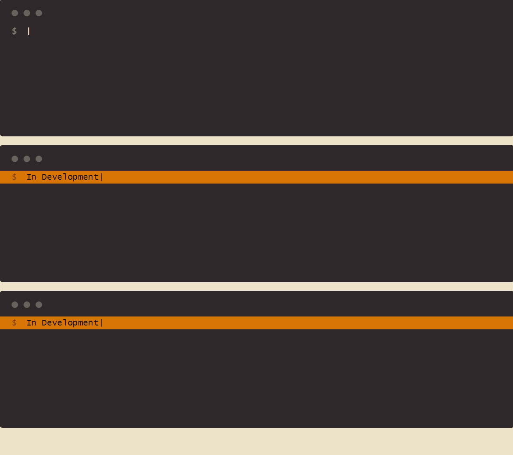

# WebOps：A Backend System Workbench

## 簡介

**WebOps** 是一個網頁平台，它讓你可以透過簡單的 UI 來管理和監控遠端的後端服務。使用卡片式按鈕對應一個特定服務。我們用 [xterm.js](https://xtermjs.org/) 來連接到指定的遠端機器執行服務，像是回傳日誌並顯示在網頁中的終端機畫面上。

此專案為由另一個用 Go 寫的後端專案 **ServerOps** 的一部分，由後端啟動本機 http server 顯示前端內容。



## 功能特色

- **卡片式按鈕**：每個按鈕代表一個遠端服務，點一下就能執行。
- **整合 xterm.js**：這個平台用 xterm.js 來提供完整的網頁終端機功能。
- **遠端服務執行**：點擊按鈕，遠端機器上的服務就會被執行。

## 事前準備

- **Node.js** (版本 20.17 或更新)

## 安裝步驟

### 1. 先把 WebOps 專案 clone 下來

```bash
git clone https://github.com/wtg42/WebOps.git
cd WebOps
```

### 2. 安裝前端依賴

```bash
npm install
```

### 4. 編譯系統檔案

```bash
npm run build
```

### 5. 後端設定（ServerOps）

把 dist/ 資料夾搬到 **ServerOps** 專案下，並啟動 Go 伺服器。

```bash
git clone https://github.com/wtg42/ServerOps.git
cd ServerOps
go install
ServerOps
```

## 授權

這個專案是根據 MIT 授權條款發布
